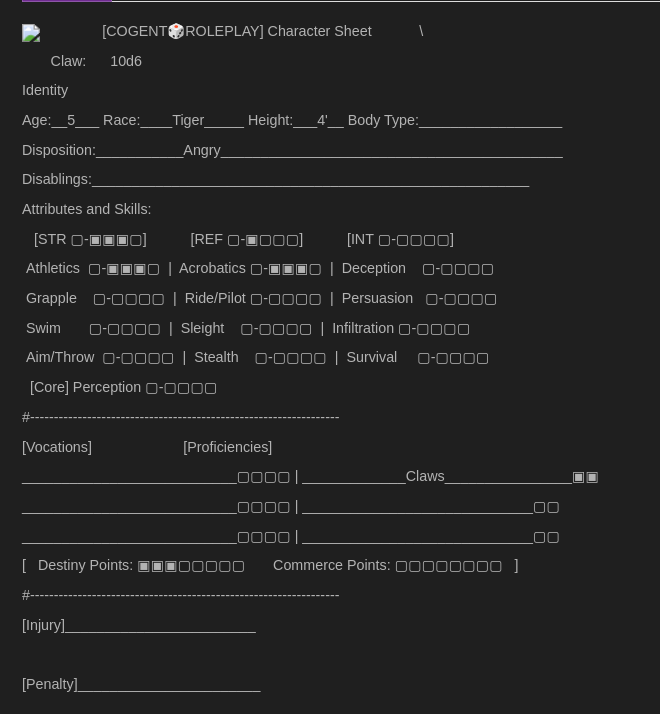
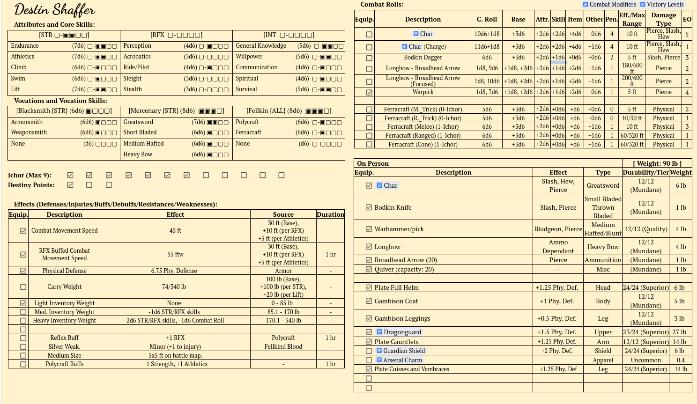
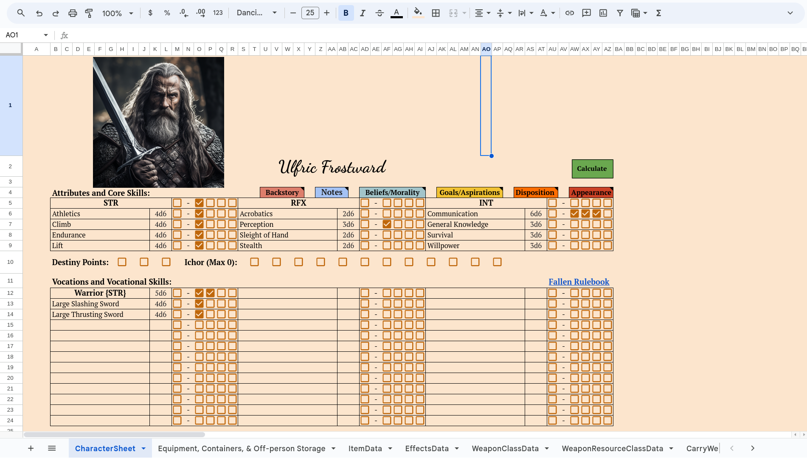
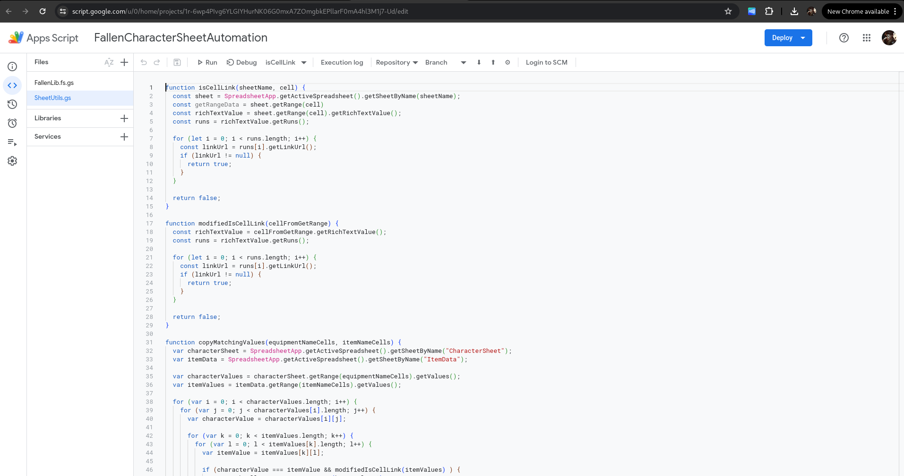
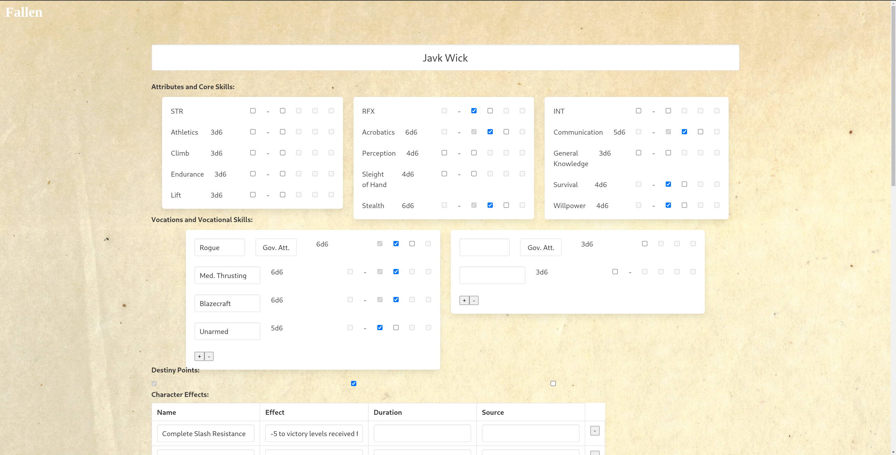
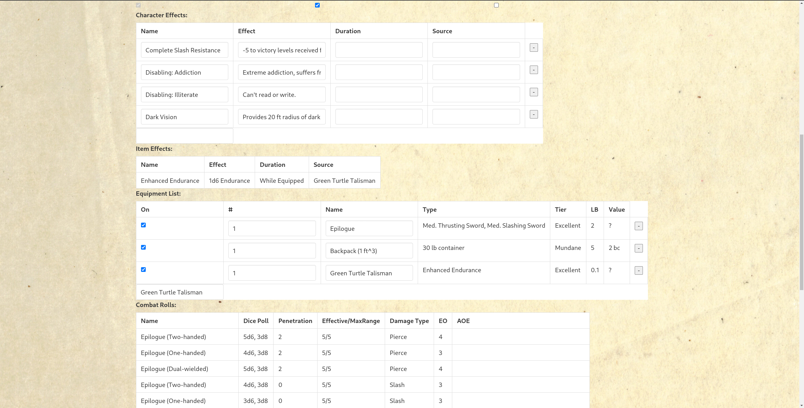
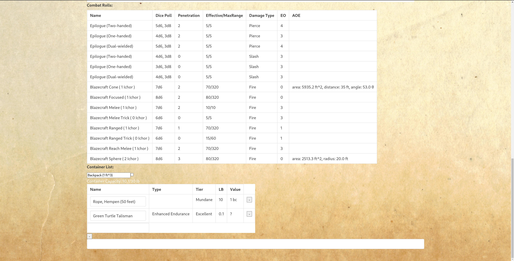

# Building Functional TTRPGs with F#

---

## Who am I

<!--  -->

  

    <!-- 

      This is a paragraph of text next to an image that takes up 30% of the width of the screen. 
      You can replace this text with whatever content you'd like.
    
 -->
    <ul>
      <li>My name is Jack Danna, aka Javk Wick.</li>
      <li>I'm a software engineer from Kentucky. The bulk of my professional career I've written software for Mining, Blasting, and Photogrammetry applications.</li>
      <!-- <li>Hobbies: BJJ, Story Telling, Table Top Roleplay Games (TTRPGs), Power Lifting, Functional Programming</li> -->
      <li>I'm also the creator/developer of Fogent Roleplay.</li>
    </ul>
  

  

    
  

---

## Objective of this talk

- Point out some funny parallels between developing code and TTRPG
- Why I chose F# for building tools for Fogent Roleplay (and convince you to try it)!
- How building with a functional first language taught me how to "Think Functionally".
- How "Thinking Functionally" bled back into the rules of my game creating a far better game.

---

## The birth of Fogent Roleplay Prt 1

  
    <ul>
      <li>Lots of D&D during lock down</li>
      <li>Started building my own worlds</li>
      <li>D&D was to constraining</li>
      <ul>
        <li>Not "open source"</li>
        <li>Class based (i.e. you have to be a wizards, rogue, etc... what if I wanna be a blacksmith)</li>
        <li>Rules are fairly coupled with the setting</li>
        <li>Lot's of complexity, hard to teach new players</li>
      </ul>
    </ul>
  
  

    
  

----

## The birth of Fogent Roleplay Prt 2

  
    <ul>
      <li>Discovered Cogent Roleplay</li>
      <ul>
        <li>Open source license</li>
        <li>Skill based (i.e. characters are defined by composing their skills)</li>
        <li>Rules are completely decoupled from any setting</li>
        <li>Simple rules, easy to get player's into</li>
        <li>Narrative focused</li>
      </ul>
    </ul>
  
  

    
  

----
## The birth of Fogent Roleplay Prt 3

  
    <ul>
      <li>Issues Cogent Roleplay</li>
      <ul>
        <li>No content, need to make your own</li>
        <li>Didn't handle certain D&D (tactical battle map combat, magic systems, character progression)</li>
        <li>Lacked emergent complexity</li>
      </ul>
    </ul>
  
  

    
  

----

## The birth of Fogent Roleplay Prt 4

  
    <ul>
      <li>Issues Cogent Roleplay</li>
      <ul>
        <li>Try Cogent out for my "The Beast of Redwall" campaign</li>
        <li>Super apparent to me and my players that there was something here but it wasn't quite there yet</li>
        <li>Started developing my own Rules under the game of "Fallen" trying to address these issue.</li>
      </ul>
    </ul>
  
  

    
  

---

## Fallen Character Sheet Prt 1

  

    
  

----

## Fallen Character Sheet Prt 2

<!-- - Made a character sheet using google docs: https://docs.google.com/document/d/1KnnLu7UrbQy-35Bf3yt0Sg0_FQPxISAIUZy19WLppSU/edit -->

  

    
  

----

## Fallen Character Sheet Prt 3

  

    
  

----

  

    
  

- Here is where I lose my mind with the Google Appscript complier.

----

## Fallen Character Sheet Prt 4

  

    <ul>
      <li>I realized I need a language with some better typing that can run as JS.</li>
      <li>F# + Fable gave me this ability</li>
      <li>Since most of my logic ends as F#, I have an ejector seat I can use if I get fed up with App Script</li>
    </ul>
  

  

    
    
  

----

----

## Fallen Character Sheet Prt 5

  

    <ul>
      <li>Switch to SAFE stack (Saturn, Azure, Fable, Elmish)</li>
      <li>Inter Ops with JS</li>
      <li>The robustness of F# in the web</li>
      <li>The Elmish Book by Ziad Ajaj</li>
      <li>Since Elmish is MVU, can use same code to target desktop or mobile (AvaloniaUI, Fabulous, )</li>
      <li>.NET ecosystem</li>
    </ul>
  

  

    
  

----

  

    
  

----

  

    
  

----

  

    
  

--- 

## Functional Thinking Prt 1

- As encapsulated the entirety of Fallen's rules into, the compiler started poking holes in the edge cases of my rules.
- I quickly realized that I had large sections of my rules that needed some work.
- Instead of working through it from the programming side, I went straight to the rules and spent probably a ~1-2 months working directly on the rules.
- Because I had been so deep into structuring the logic of the F# application, I went out of my way write my rules as functionally as I could. This lead to a completely decoupled game now longer tied to my setting Fallen. Hence Fogent Roleplay was born.
- After Fogent Roleplay 1.0 was finalized, I went ahead and have begun refactoring all my old Fallen Character Sheet code. It is amazing how horrible your code looks 2 months in the future, lol.
- Future plans to to finish the character sheet logic, make the UI more appealing, move my database to postgresSQL!

## Take aways

- Try F#, it's amazing that for a relatively smaller user base, it swings way above it's weight class.
- Thinking functionally doesn't just apply to programming. It's a mindset that can be applied in far more places than you may have initially considered. I just happened to discover it while working on my nerd game. :)
- Start that coding passion project today. Finding any way to combine one of your passions with your programming is life changing. I can confidently say that prior to the couple year side project, I wasn't as passionate about programming. Now I honestly love a good programming session as much as spending time playing Fogent with my friends, which is a hight bar.
- We often play the parts of wizards solving other people's problems. It's a real treat to solve your own problems for once!
